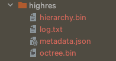

# Via Appia Viewer

> [Beginner Tutorial](./TUTORIAL.MD)

[](https://app.netlify.com/sites/via-appia/deploys)

Previous project (2015-2016): https://github.com/Via-Appia/PattyVis

## Build Setup

Enable `eslint --fix on file save` in your code editor.

```bash
# install dependencies
$ yarn install

# serve with hot reload at localhost:3000
$ yarn dev

# generate static project
$ yarn generate
```


Archeological pointcloud viewer for use in a museum setting. Based on storylines (narratives) that are defined by an artist or expert, a user should be able to view multiple _storylines_ , all consisting of multiple _pages_.

## high resolution pointcloud locally: 
You need to download and place the pointclouds data into the `/static/pointclouds/highres`. 
The structure looks like:



## Upload the PointCloud data in cloud storage
- You need to have installed locally [gsutils](https://cloud.google.com/storage/docs/gsutil_install) 
- log in you google account to get writing permissions
- Navigate to the root where the data folder is placed and start the copy of the files to the google cloud storage: 
```shell
gsutil -m cp -r ./data gs://via-appia-20540.appspot.com
```
Access the cloud storage dashboard [here](https://console.cloud.google.com/storage/browser/via-appia-20540.appspot.com) 


# Enable settings locally
You can change local setting by creating a `.env` file and enabling the settings you want to have:
```shell
LOCAL_POINTCLUDS = true
POINTS_BUDGET = 1000000
```
